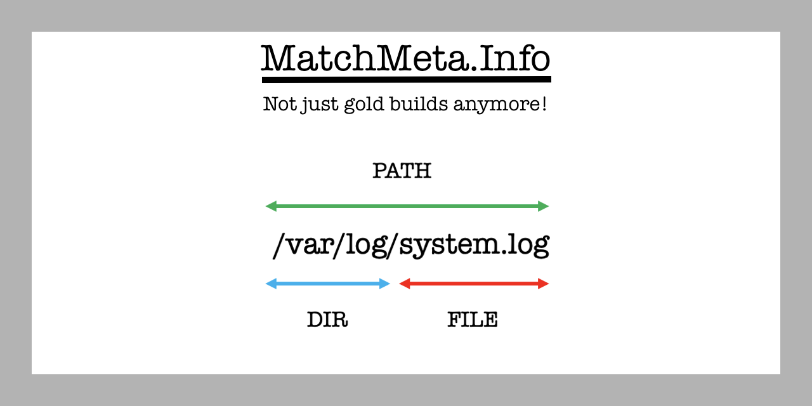

MatchMeta.Info project takes a list of AMIs owned by Amazon in the Oregon (US-WEST-2) region for ```x86_64``` and ```arm64``` architecture to collect investigation artifacts automatically.

 - https://github.com/jblukach/matchmeta

AMI names that start with ```amazon/amzn``` and end with ```-gp2``` will be launched into a temporary VPC to collect the ```System.map``` file and run the ```getmeta``` collection script.

 - https://pypi.org/project/getmeta

This enrichment option allows the analysis to take traditional hashing a step further by knowing which directories, files, and paths are standard for specific releases of the Amazon Linux distribution.

A status page for the MatchMeta.Info project keeps track of when hash libraries need manual updates for newly released AMIs by AWS.

 - https://status.matchmeta.info

An API can also automate this process by providing the last updated timestamp with a filename containing the SHA256 hash to verify the downloaded zip file's integrity from the returned access link.

 - https://jblukach.gumroad.com/l/AMZNHASH

If there is another format that you would find helpful, please feel free to reach out!

Example:

```python

import requests

key = ''
url = 'https://sha256.lukach.io/hashes'

headers = {'x-api-key': key}

r = requests.get(url, headers = headers)

output = r.json()

d = requests.get(output['link'])

if d.status_code == 200:
    with open(output['filename'], 'wb') as f:
        f.write(d.content)

```
